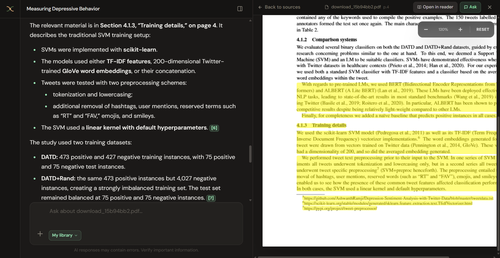
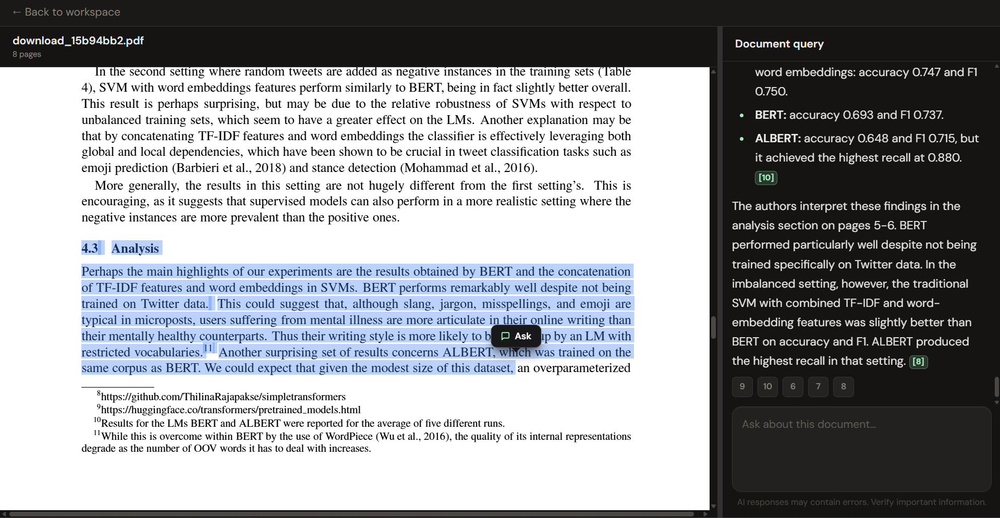
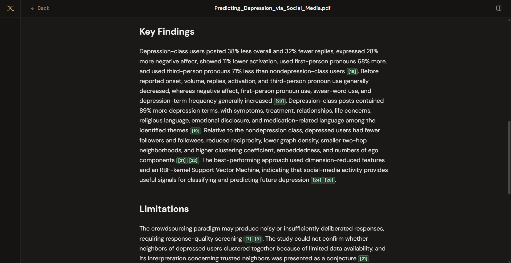
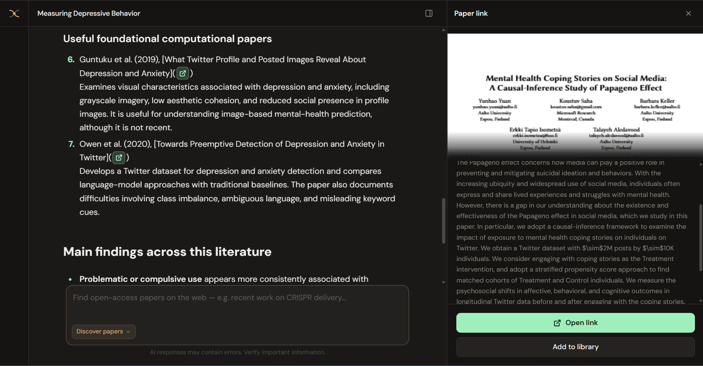
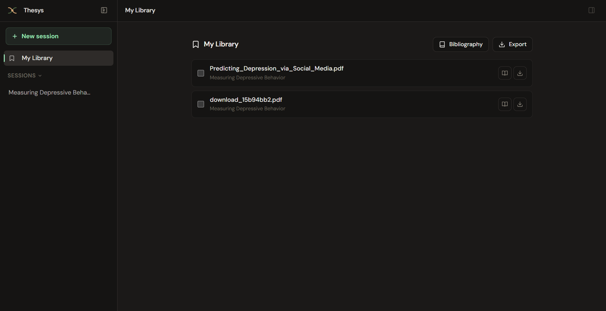
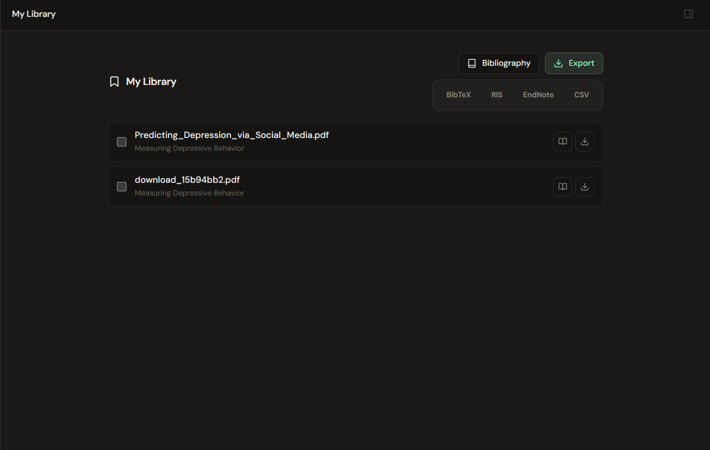

# Thesys

Local research workspace: search open-access papers, upload PDFs, ask questions with on-page highlights, and export citations.



## Features

**Chat over your research papers.** Answers cite sources in the document. Click a citation to jump the preview and highlight the passage.

**Reader mode.** Open a paper full-width, select text, and ask about that span.



**Document summaries.** Generated from the PDF, with the same citation → highlight path.



**Discover papers.** Search the web (OpenAlex) from the chat, preview a record, open the link, or add it to the library.



**Library and export.** Session files in one place. Bibliography export as BibTeX, RIS, EndNote, or CSV.





## How it runs

- **Frontend:** React (Vite) on port `5000`
- **Backend:** FastAPI on port `8000`
- **Local RAG:** Docling ingest → Chroma + BGE embeddings → BGE reranker
- **Chat:** OpenAI via LangChain
- **Paper search:** OpenAlex (optional API key)
- **Citations:** CiteAs (uses `EMAIL`)

PDFs, vectors, and chat history stay on disk under `backend/data/`. First ingest downloads embedding/rerank weights (Hugging Face). GPU helps; CPU works and is slower.

## Requirements

- Python 3.11+
- Node.js 20+
- An OpenAI API key

## Setup

```bash
python -m venv .venv
# Windows: .venv\Scripts\activate
# macOS/Linux: source .venv/bin/activate
pip install -r requirements.txt
```

```bash
cp backend/.env.example backend/.env
cp frontend/.env.example frontend/.env
```

Set at least `OPENAI_API_KEY` and `EMAIL` in `backend/.env`. `HF_TOKEN` is optional (Hugging Face rate limits). `OPENALEX_API_KEY` is optional.

```bash
cd backend
python main.py
```

```bash
cd frontend
npm install
npm run dev
```

Open [http://127.0.0.1:5000](http://127.0.0.1:5000). The UI talks to `VITE_API_BASE_URL` (default `http://127.0.0.1:8000`).

## Later

- [ ] Optional Cohere embeddings and reranker for users who want higher retrieval quality. Local BGE stays the default.
- [ ] Optional ingest tradeoff: PyMuPDF when you want speed, Docling when you want layout quality.

## License

[AGPL-3.0](LICENSE)
