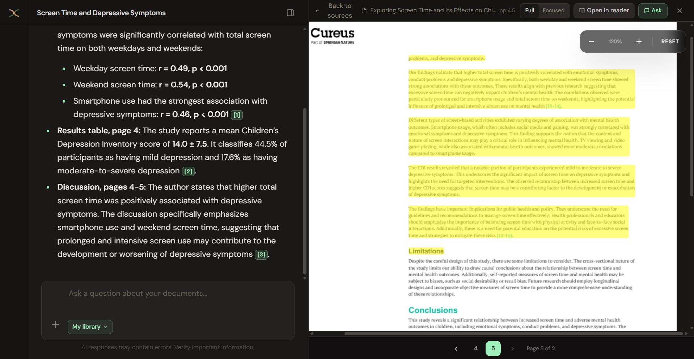
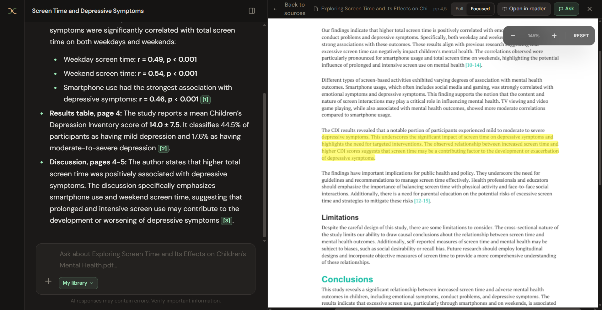
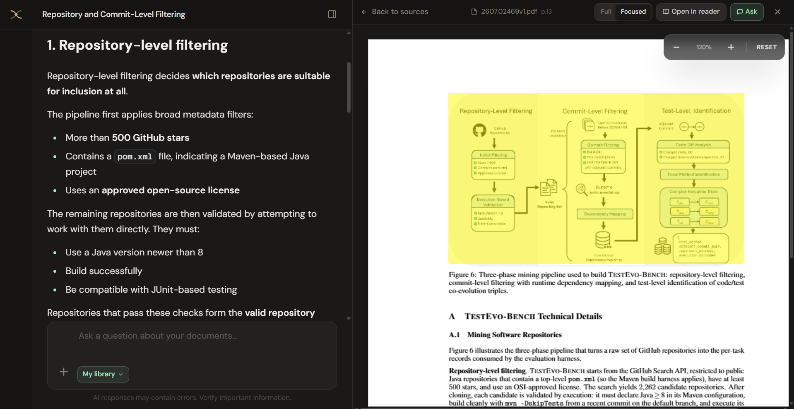

<div align="center">

# Thesys

[](https://www.python.org/downloads/)
[](LICENSE)
[](https://github.com/Sreehari05055/thesys-core/issues)

</div>

Local research workspace: search open-access papers (OpenAlex and arXiv), upload PDFs, ask questions with on-page highlights, and export citations.

Papers, embeddings, and chat history stay on disk. Citations jump to the PDF. Chat needs an OpenAI API key; ingest and retrieval run locally (Docling, Chroma, BGE).

Copy `backend/.env.example` to `backend/.env`, set `OPENAI_API_KEY` and `EMAIL`, then:

```bash
docker compose up --build
```

Open [http://127.0.0.1:5000](http://127.0.0.1:5000). First build is large; first ingest downloads Hugging Face weights inside the container. `docker compose down` keeps the `thesys-data` volume (papers and chat). `docker compose down -v` deletes it.



## Features

**Chat over your research papers.** Answers cite sources in the document. Click a citation to jump the preview. **Full** highlights the whole retrieved passage; **Focused** (default) paints a tighter highlight on the same passage. Toggle in the PDF header.



**Reader mode.** Open a paper full-width, select text, and ask about that span.


**Document summaries.** Follows a general format of problem statement, methodology, key findings, limitations, and metrics. Citations still jump to the highlighted passage.


**Figures and diagrams.** Ingest describes plots, pipelines, and other figures so chat and summaries can cite them. Click a citation to highlight the figure on the page.



**Discover papers.** Search open-access literature from OpenAlex and arXiv in one pool, then preview a record, open the link, or add it to the library.


**Library and export.** Session files in one place. Bibliography export as BibTeX, RIS, EndNote, or CSV.


## How it runs

- **Frontend:** React (Vite) on port `5000`
- **Backend:** FastAPI on port `8000`
- **Local RAG:** Docling ingest → Chroma + BGE embeddings → BGE reranker
- **OCR:** off by default (`DO_OCR=false`); set `DO_OCR=true` for scanned PDFs
- **Chat:** OpenAI via LangChain
- **Paper search:** OpenAlex + arXiv (open-access; optional OpenAlex API key)
- **Citations:** CiteAs (uses `EMAIL`)

PDFs, vectors, and chat history stay on disk under `backend/data/`. First ingest downloads embedding/rerank weights (Hugging Face). GPU helps; CPU works and is slower.

## Local setup

Needs Python 3.11+, Node.js 20+, and an OpenAI API key (or use Docker above).

```bash
python -m venv .venv
# Windows: .venv\Scripts\activate
# macOS/Linux: source .venv/bin/activate
pip install -r requirements.txt
```

```bash
cp backend/.env.example backend/.env
cp frontend/.env.example frontend/.env
```

Set at least `OPENAI_API_KEY` and `EMAIL` in `backend/.env`. `HF_TOKEN` is optional (Hugging Face rate limits). `OPENALEX_API_KEY` is optional. `DO_OCR` defaults to `false`; set it to `true` to OCR scanned / image-only PDFs on ingest (slower).

```bash
cd backend
python main.py
```

```bash
cd frontend
npm install
npm run dev
```

Open [http://127.0.0.1:5000](http://127.0.0.1:5000). The UI talks to `VITE_API_BASE_URL` (default `http://127.0.0.1:8000`).

## Later

- [ ] Optional Cohere embeddings and reranker for users who want higher retrieval quality. Local BGE stays the default.
- [ ] Per-chat settings: saved title, selected model, and reasoning effort.

## License

[AGPL-3.0](LICENSE). Maintained by [Sreehari](https://github.com/Sreehari05055). [Issues](https://github.com/Sreehari05055/thesys-core/issues) and pull requests are welcome; start from an issue if the change is large.
